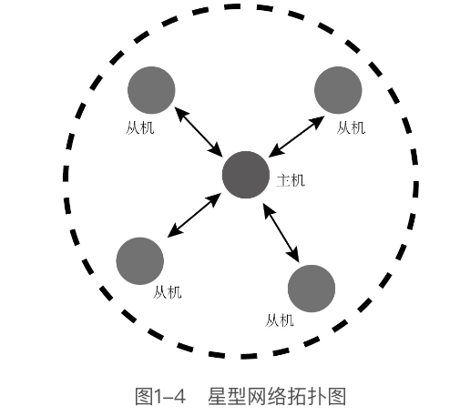
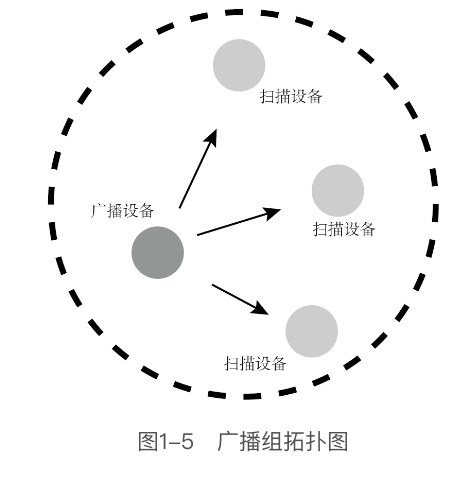

# BLE4.0简介

蓝牙联盟于2010年发布了蓝牙4.0，蓝牙4.0由**经典蓝牙**（Classic Bluetooth）和**低功耗蓝牙**（Bluetooth Low Energy）两个部分组成。

**为什么会出现低功耗蓝牙？**

经典蓝牙可以满足传输音频、图片及文件等应用场景的需求，对于更多需要低功耗、多连接的应用场景却有心无力

蓝牙4.0的芯片模式分为**单模**（Single Mode）与**双模**（Dual Mode）两种。**单模**只能与蓝牙4.0交互，无法与蓝牙3.0/2.1/2.0向下兼容，仅支持与低功耗蓝牙（BLE）设备的连接；**双模**可以向下兼容蓝牙3.0/2.1/2.0，通常智能手机、平板电脑、计算机等设备会采用双模的蓝牙芯片，以便与低功耗蓝牙设备和传统蓝牙设备进行交互。

**单模**主要面向高集成、低数据量、低功耗的应用场景，具有快速连接、可靠的点对多点数据传输、安全的加密连接等特性

蓝牙4.0 BLE规范中定义了`GAP(Generic Access Profile)`和`GATT（Generic Attribute）`两个基本配置文件。

+ 协议栈中的GAP层负责设备访问模式和进程，包括设备发现、建立连接、终止连接、初始化安全特性和设备配置。
+ 协议栈中的GATT层用于已连接的蓝牙设备之间的数据通信。

**蓝牙4.0 BLE无线网络拓扑结构**

蓝牙4.0 BLE网络拓扑结构分为星型拓扑和广播组拓扑

