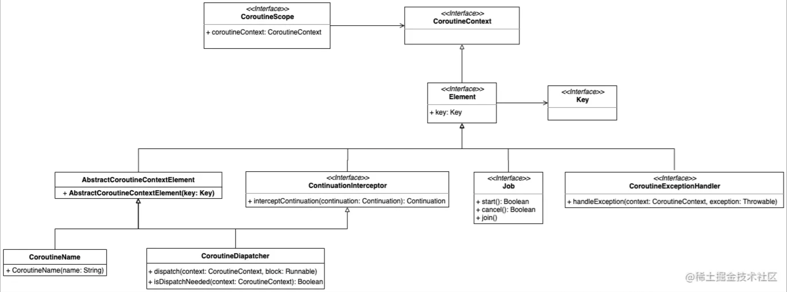

# CoroutineContext

创建协程的时候，如`launch`

```kotlin
public fun CoroutineScope.launch(
    context: CoroutineContext = EmptyCoroutineContext,
    start: CoroutineStart = CoroutineStart.DEFAULT,
    block: suspend CoroutineScope.() -> Unit
): Job
```

其中就有个`CoroutineContext`类型的参数

`CoroutineContext`是个接口，定义如下：

```kotlin
/**
 * Persistent context for the coroutine. It is an indexed set of [Element] instances.
 * An indexed set is a mix between a set and a map.
 * Every element in this set has a unique [Key].
 */
@SinceKotlin("1.3")
public interface CoroutineContext {
    /**
     * Returns the element with the given [key] from this context or `null`.
     */
    public operator fun <E : Element> get(key: Key<E>): E?

    /**
     * Accumulates entries of this context starting with [initial] value and applying [operation]
     * from left to right to current accumulator value and each element of this context.
     */
    public fun <R> fold(initial: R, operation: (R, Element) -> R): R

    /**
     * Returns a context containing elements from this context and elements from  other [context].
     * The elements from this context with the same key as in the other one are dropped.
     */
    public operator fun plus(context: CoroutineContext): CoroutineContext =
        if (context === EmptyCoroutineContext) this else // fast path -- avoid lambda creation
            context.fold(this) { acc, element ->
                val removed = acc.minusKey(element.key)
                if (removed === EmptyCoroutineContext) element else {
                    // make sure interceptor is always last in the context (and thus is fast to get when present)
                    val interceptor = removed[ContinuationInterceptor]
                    if (interceptor == null) CombinedContext(removed, element) else {
                        val left = removed.minusKey(ContinuationInterceptor)
                        if (left === EmptyCoroutineContext) CombinedContext(element, interceptor) else
                            CombinedContext(CombinedContext(left, element), interceptor)
                    }
                }
            }

    /**
     * Returns a context containing elements from this context, but without an element with
     * the specified [key].
     */
    public fun minusKey(key: Key<*>): CoroutineContext

    /**
     * Key for the elements of [CoroutineContext]. [E] is a type of element with this key.
     */
    public interface Key<E : Element>

    /**
     * An element of the [CoroutineContext]. An element of the coroutine context is a singleton context by itself.
     */
    public interface Element : CoroutineContext {
        /**
         * A key of this coroutine context element.
         */
        public val key: Key<*>

        public override operator fun <E : Element> get(key: Key<E>): E? =
            @Suppress("UNCHECKED_CAST")
            if (this.key == key) this as E else null

        public override fun <R> fold(initial: R, operation: (R, Element) -> R): R =
            operation(initial, this)

        public override fun minusKey(key: Key<*>): CoroutineContext =
            if (this.key == key) EmptyCoroutineContext else this
    }
}
```

> Persistent context for the coroutine. It is an indexed set of [Element](https://kotlinlang.org/api/latest/jvm/stdlib/kotlin.coroutines/-coroutine-context/-element/index.html) instances. An indexed set is a mix between a set and a map. Every element in this set has a unique [Key](https://kotlinlang.org/api/latest/jvm/stdlib/kotlin.coroutines/-coroutine-context/-key.html).
>
> 大致意思是说，是Element的集合，每个Element都有一个key


其继承关系大致如下：




## CoroutineContext的元素

> 构造CoroutineScope使用到的CoroutineContext是一个特殊的集合，这个集合它既有Map的特点，也有Set的特点，集合的每一个元素都是Element，每个Element都有一个Key与之对应，对于相同Key的Element是不可以重复存在的，Element之间可以通过 **+** 号组合起来

`CoroutineContext`主要由以下4个`Element`组成：

+ `Job`：协程的唯一标识，用来控制协程的生命周期(new、active、completing、completed、cancelling、cancelled)；

+ `CoroutineDispatcher`：指定协程运行的线程(IO、Default、Main、Unconfined);

+ `CoroutineName`: 指定协程的名称，默认为coroutine;

+ `CoroutineExceptionHandler`: 指定协程的异常处理器，用来处理未捕获的异常.


