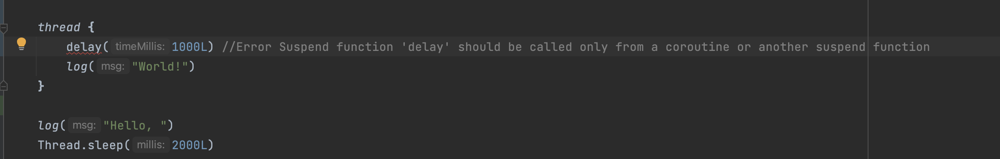

# 协程

参考：

+ [协程基础](https://www.kotlincn.net/docs/reference/coroutines/basics.html#协程基础)

+ [一文快速入门 Kotlin 协程](https://juejin.cn/post/6908271959381901325#heading-4)


协程是轻量级的线程


## GlobalScope

如下例子，创建10000个协程，运行起来毫无压力：

```kotlin
fun main(args: Array<String>) {
    (1..10000).forEach {
        GlobalScope.launch {
            val threadName = Thread.currentThread().name
            log(it)
        }
    }
    Thread.sleep(1000)
    log("end")
}

private fun log(msg: Any?) = println("[${Thread.currentThread().name}] $msg")
```

log输出如下：

```
[DefaultDispatcher-worker-9] 9814
[DefaultDispatcher-worker-3] 9753
[DefaultDispatcher-worker-1] 9986
[DefaultDispatcher-worker-4] 9984
[DefaultDispatcher-worker-10] 9981
[DefaultDispatcher-worker-7] 9969
[DefaultDispatcher-worker-8] 9948
[main] end
```


在有如下的例子：

```kotlin
fun main(args: Array<String>) {
    GlobalScope.launch {
        delay(1000L) //非阻塞的等待 1 秒钟（默认时间单位是毫秒）
        log("World!")
    }
    log("Hello, ")
    Thread.sleep(2000L)
}

private fun log(msg: Any?) = println("[${Thread.currentThread().name}] $msg")
```

log输出如下：

```
[main] Hello, 
[DefaultDispatcher-worker-1] World!
```

如果将`GlobalScope.launch { …… }` 替换为 `thread { …… }`，会有如下错误：




