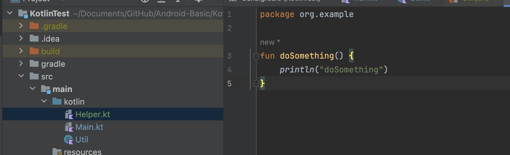
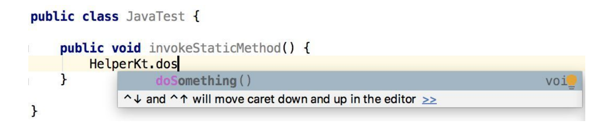

# Companion Object

使用单例类的写法会将整个类中的所有方法全部变成类似于静态方法的调用方式，而如果我们只是希望让类中的某一个方法变成静态方法的调用方式该怎么办呢?

使用`companion object`

```kotlin
class Util {
    fun doAction1() {
        println("do action1")
    }
    companion object {
        fun doAction2() {
            println("do action2")
        }
    }
}
```

> `doAction2()`方法其实也并不是静态方法，`companion object`这个关键字实际上会在`Util`类的内部创建一个伴生类，而`doAction2()`方法就是定义在这个伴生类里面的实例方法。只是Kotlin会保证`Util`类始终只会存在一个伴生类对象，因此调用`Util.doAction2()`方法实际上就是调用了`Util`类中伴生对象的`doAction2()`方法


------

我自己的理解类似一个static方法，但其实不是static，只是类似

> 请注意，即使伴生对象的成员看起来像其他语言的静态成员，在运行时他们仍然是真实对象的实例成员，而且，例如还可以实现接口

```kotlin
class MyClass {
    companion object Factory {
        fun create(): MyClass = MyClass()
    }
}

val instance = MyClass.create()
```

参考：

+ [面向对象高级：伴生对象](https://zhuanlan.zhihu.com/p/26713535)


如下的类：

```kotlin
class Person(val name: String) {
  companion object {
    val anonymousPerson = Person("Anonymous")
    fun sayHello() {
      println("Hello")
    }
  }
  
  var age = 0
  fun sayName() {
    println("My name is $name")
  }
}
```

反编译后，类的形式如下：

```java
public final class Person {
  private final int age;
  private final String name;
  private static final Person anonymousPerson = new Person("Anonymous");
  public static final Person.Companion Companion = new Person.Companion();
  
  public Person(String name) {
    this.name = name;
  }
  // getAge()、setAge()、getName()
  
  public final void sayName() {
    System.out.println("My name is " + this.name);
  }
  
  public static final class Companion {
    private Companion() {}
    
    public final Person getAnonymousPerson() {
      return Person.anonymousPerson;
    }
    
    public final void sayHello() {
      System.out.println("Hello")
    }
  }
}
```

**使用伴生对象实际上是在这个类内部创建了一个名为 Companion 的静态单例内部类**


## 真正实现静态方法

前面使用的单例类和`companion object`都只是在语法的形式上模仿了静态方法的调用方式，实际上它们都不是真正的静态方法。因此如果你在Java代码中以静态方法的形式去调用的话，你会发现这些方法并不存在

### @JvmStatic注解

`@JvmStatic`注解只能加在单例类或`companion object`中的方法上

```kotlin
class Util {
    fun doAction1() {
        println("do action1")
    }

    companion object {

        @JvmStatic
        fun doAction2() {
            println("do action2")
        }
    }
}
```

将kotlin转为java后的代码如下：

```java
@Metadata(mv={1, 9, 0}, k=1, xi=48, d1={"\u0000\u0014\n\u0002\u0018\u0002\n\u0002\u0010\u0000\n\u0002\b\u0002\n\u0002\u0010\u0002\n\u0002\b\u0002\u0018\u0000 \u00052\u00020\u0001:\u0001\u0005B\u0005\u00a2\u0006\u0002\u0010\u0002J\u0006\u0010\u0003\u001a\u00020\u0004\u00a8\u0006\u0006"}, d2={"Lorg/example/Util;", "", "()V", "doAction1", "", "Companion", "KotlinTest"})
public final class Util {
    @NotNull
    public static final Companion Companion = new Companion(null);

    public final void doAction1() {
        System.out.println((Object)"do action1");
    }

    @JvmStatic
    public static final void doAction2() {
        Companion.doAction2();
    }

    @Metadata(mv={1, 9, 0}, k=1, xi=48, d1={"\u0000\u0012\n\u0002\u0018\u0002\n\u0002\u0010\u0000\n\u0002\b\u0002\n\u0002\u0010\u0002\n\u0000\b\u0086\u0003\u0018\u00002\u00020\u0001B\u0007\b\u0002\u00a2\u0006\u0002\u0010\u0002J\b\u0010\u0003\u001a\u00020\u0004H\u0007\u00a8\u0006\u0005"}, d2={"Lorg/example/Util$Companion;", "", "()V", "doAction2", "", "KotlinTest"})
    public static final class Companion {
        private Companion() {
        }

        @JvmStatic
        public final void doAction2() {
            System.out.println((Object)"do action2");
        }

        public /* synthetic */ Companion(DefaultConstructorMarker $constructor_marker) {
            this();
        }
    }
}
```


### 顶层方法

Kotlin编译器会将所有的顶层方法全部编译成静态方法




刚才创建的Kotlin文件名叫作`Helper.kt`，于是Kotlin编译器会自动创建一个叫作`HelperKt`的Java类，`doSomething()`方法就是以静态方法的形式定义在`HelperKt`类里面的，因此在Java中使用`HelperKt.doSomething()`的写法来调用就可以了




