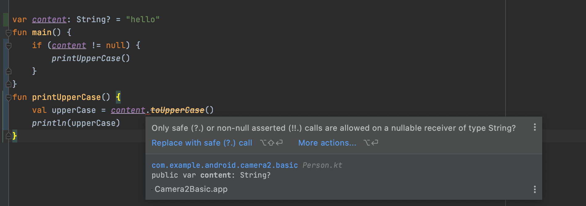

# 空指针检查

### 判空辅助工具

最常用的`?.`操作符

当对象不为空时正常调用相应的方法，当对象为空时则什么都不做

```kotlin
if (a != null) {
 a.doSomething()
}
```

`?.`操作符就可以简化成

```kotlin
a?.doSomething()
```


**`?:`操作符**

`?:`操作符。这个操作符的左右两边都接收一个表达式，如果左边表达式的结果不为空就返回左边表达式的结果，否则就返回右边表达式的结果

```kotlin
val c = if (a ! = null) {
 a
} else {
 b
}
```

这段代码的逻辑使用`?:`操作符就可以简化成：

```kotlin
val c = a ?: b
```


**结合起来使用**

如判断字符串的长度

```kotlin
fun getTextLength(text: String?) = text?.length ?: 0
```


**非空断言**

如下的代码：

```kotlin
var content: String? = "hello"
fun main() {
 if (content != null) {
 printUpperCase()
 }
}
fun printUpperCase() {
 val upperCase = content.toUpperCase()
 println(upperCase)
}
```

但是会提示出错：



> 因为`printUpperCase()`函数并不知道外部已经对`content`变量进行了非空检查，在调用`toUpperCase()`方法时，还认为这里存在空指针风险，从而无法编译通过。

在这种情况下，如果我们想要强行通过编译，可以使用**非空断言**工具，写法是在对象的后面加上`!!`

```kotlin
fun printUpperCase() {
 val upperCase = content!!.toUpperCase()
 println(upperCase)
}
```


### let

let既不是操作符，也不是什么关键字，而是一个函数

如下的代码：

```kotlin
fun doStudy(study: Study?) {
 study?.readBooks()
 study?.doHomework()
}
```

可以结合使用`?.`操作符和`let`函数来对代码进行优化

```kotlin
fun doStudy(study: Study?) {
 study?.let { stu ->
 stu.readBooks()
 stu.doHomework()
 }
}
```

当Lambda表达式的参数列表中只有一个参数时，可以不用声明参数名，直接使用`it`关键字来代替即可

```kotlin
fun doStudy(study: Study?) {
 study?.let {
 it.readBooks()
 it.doHomework()
 }
}
```

`let`函数是可以处理全局变量的判空问题的，而`if`判断语句则无法做到这一点

比如将`doStudy()`函数中的参数变成一个全局变量，使用`let`函数仍然可以正常工作，但使用`if`判断语句则会提示错误


> 之所以这里会报错，是因为**全局变量的值随时都有可能被其他线程所修改，即使做了判空处理，仍然无法保证if语句中的study变量没有空指针风险**
