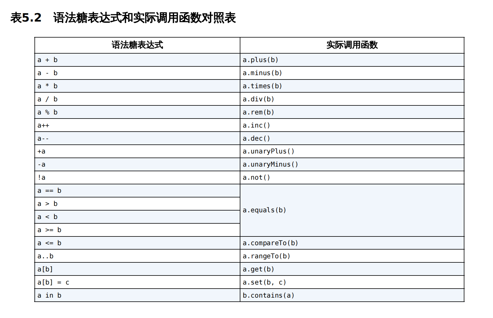

# 运算符重载

运算符重载使用的是`operator`关键字

在指定函数的前面加上`operator`关键字，就可以实现运算符重载的功能了

**指定函数是什么?**

加号运算符对应的是`plus()`函数

减号运算符对应的是`minus()`函数

**语法糖表达式和实际调用函数对照表**




例如下面的例子实现money和money相加，money和数字相加的功能

```kotlin
class Money(val value: Int) {

    // 和Money对象相加
    operator fun plus(money: Money): Money {
        val sum = value + money.value
        return Money(sum)
    }

    // 和一个数相加
    operator fun plus(newValue: Int): Money {
        val sum = value + newValue
        return Money(sum)
    }
}
```

使用方式如下：

```kotlin
    val money1 = Money(5)
    val money2 = Money(10)
    val money3 = money1 + money2
    println(money3.value)
    val money4 = money3 + 20
    println(money4.value)
```


从上面的可可知，`contain`对应的语法糖是`in`，所以：

```kotlin
if ("hello".contains("he")) {
}
```

借助重载的语法糖表达式，也可以这样写

```kotlin
if ("he" in "hello") {
}
```


另外一个例子，`repeat(n)` 使用`str * n`来实现

```kotlin
fun getRandomLengthString(str: String): String {
 val n = (1..20).random()
 val builder = StringBuilder()
 repeat(n) {
 	builder.append(str)
 }
 return builder.toString()
}
```

可实现为：

```kotlin
operator fun String.times(n: Int): String {
 val builder = StringBuilder()
 repeat(n) {
 	builder.append(this)
 }
 return builder.toString()
}
```

字符串就拥有了和一个数字相乘的能力，比如执行如下代码:

```kotlin
    val str = "abc" * 3
    println(str)
```


