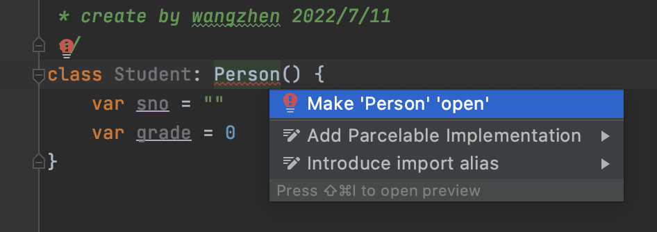
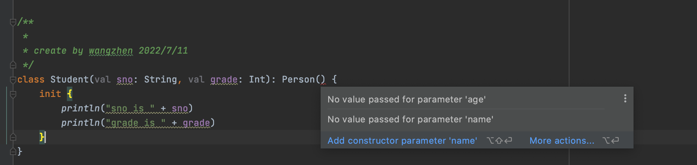
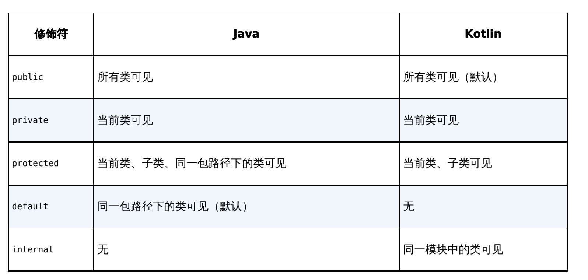

# 类和对象

## 类

Kotlin中实例化一个类的方式和Java是基本类似的，只是去掉了`new`关键字而已

在Kotlin中任何一个非抽象类默认都是不可以被继承的，相当于Java中给类声明了`final`关键字



```kotlin
class Student: Person() {
    var sno = ""
    var grade = 0
}
```


**主构造函数**

主构造函数将会是你最常用的构造函数，每个类默认都会有一个不带参数的主构造函数

主构造函数的特点是没有函数体，直接定义在类名的后面即可

```kotlin
class Student(var sno: String, var grade: Int): Person() {

}
```

> 将学号和年级这两个字段都放到了主构造函数当中，这就表明在对Student类进行实例化的时候，必须传入构造函数中要求的所有参数
>
> ```kotlin
> val student = Student("a123", 5)
> ```

另外，由于构造函数中的参数是在创建实例的时候传入的，不像之前的写法那样还得重新赋值，因此我们可以将参数全部声明成`val`

```kotlin
class Student(val sno: String, val grade: Int): Person() {

}
```

主构造函数没有函数体，如果我想在主构造函数中编写一些逻辑，该怎么办呢？Kotlin给我们提供了一个`init`结构体，所有主构造函数中的逻辑都可以写在里面

```kotlin
class Student(val sno: String, val grade: Int): Person() {
    init {
        println("sno is " + sno)
        println("grade is " + grade)
    }
}
```

**子类中的构造函数必须调用父类中的构造函数**

子类的主构造函数调用父类中的哪个构造函数，在继承的时候通过**括号**来指定

> Person类后面的一对空括号表示Student类的主构造函数在初始化的时候会调用Person类的无参数构造函数，即使在无参数的情况下，这对括号也不能省略


如果将Person修改为如下的形式：

```kotlin
open class Person(val name: String, val age: Int) {
    fun eat() {
        println(name + " is eating. He is " + age + " years old.")
    }
}
```

则原来的Student类会提示：



> **错误原因**：Person类后面的空括号表示要去调用Person类中无参的构造函数，但是Person类现在已经没有无参的构造函数了

如果我们想解决这个错误的话，就必须给`Person`类的构造函数传入`name`和`age`字段，可是`Student`类中也没有这两个字段呀。很简单，没有就加呗。我们可以在`Student`类的主构造函数中加上`name`和`age`这两个参数，再将这两个参数传给`Person`类的构造函数

```kotlin
class Student(val sno: String, val grade: Int, name: String, age: Int) : Person(name, age) {
    init {
        println("sno is " + sno)
        println("grade is " + grade)
    }
}
```

> **注意**，我们在`Student`类的主构造函数中增加`name`和`age`这两个字段时，不能再将它们声明成`val`，因为在主构造函数中声明成`val`或者`var`的参数将自动成为该类的字段，这就会导致和父类中同名的`name`和`age`字段造成冲突。因此，这里的`name`和`age`参数前面我们不用加任何关键字，让它的作用域仅限定在主构造函数当中即可。


**次构造函数**

当一个类既有主构造函数又有次构造函数时，所有的次构造函数都必须调用主构造函数（包括间接调用）

次构造函数是通过`constructor`关键字来定义的

```kotlin
class Student(val sno: String, val grade: Int, name: String, age: Int) : Person(name, age) {
    init {
        println("sno is " + sno)
        println("grade is " + grade)
    }

    constructor(name: String, age: Int) : this("", 0, name, age) {
    }
    constructor() : this("", 0) {
    }
}
```

> 第一个次构造函数接收`name`和`age`参数，然后它又通过`this`关键字调用了主构造函数，并将`sno`和`grade`这两个参数赋值成初始值
>
> 第二个次构造函数不接收任何参数，它通过`this`关键字调用了我们刚才定义的第一个次构造函数，并将`name`和`age`参数也赋值成初始值


上面的形式，也可以通过默认参数值来实现

```kotlin
class Student(val sno: String = "", val grade: Int = 0, name: String = "", age: Int = 0) :
 Person(name, age) {
}
```


**特殊情况**

类中只有次构造函数，没有主构造函数

当一个类没有显式地定义主构造函数且定义了次构造函数时，它就是没有主构造函数的

```kotlin
class Student : Person {
 constructor(name: String, age: Int) : super(name, age) {
 }
}
```

> 1.然没有主构造函数，继承Person类的时候也就不需要再加上括号了
>
> 2.由于没有主构造函数，次构造函数只能直接调用父类的构造函数，上述代码也是将`this`关键字换成了`super`关键字


## 接口

Kotlin接口，允许对接口中定义的函数进行默认实现

```kotlin
interface Study {
 fun readBooks()
 fun doHomework() {
 	println("do homework default implementation.")
 }
}
```


**函数的可见性修饰符**

Kotlin中`public`修饰符是默认项，而在Java中`default`才是默认项




## 数据类

数据类通常需要重写`equals()`、`hashCode()`、`toString()`这几个方法

> `equals()`方法用于判断两个数据类是否相等。
>
> `hashCode()`方法作为`equals()`的配套方法，也需要一起重写，否则会导致`HashMap`、`HashSet`等hash相关的系统类无法正常工作
>
> `toString()`方法用于提供更清晰的输入日志，否则一个数据类默认打印出来的就是一行内存地址

Java实现：

```java
public class CellPhone {
    String brand;
    double price;

    public CellPhone(String brand, double price) {
        this.brand = brand;
        this.price = price;
    }

    @Override
    public boolean equals(Object obj) {
        if (obj instanceof CellPhone) {
            CellPhone other = (CellPhone) obj;
            return other.brand.equals(brand) && other.price == price;
        }
        return false;
    }

    @Override
    public int hashCode() {
        return brand.hashCode() + (int)price;
    }

    @Override
    public String toString() {
        return "CellPhone{" +
                "brand='" + brand + '\'' +
                ", price=" + price +
                '}';
    }
}
```

Kotlin数据类：

```kotlin
data class Cellphone(val brand: String, val price: Double)
```

> 当在一个类前面声明了`data`关键字时，就表明你希望这个类是一个数据类，Kotlin会根据主构造函数中的参数帮你将`equals()`、`hashCode()`、`toString()`等固定且无实际逻辑意义的方法自动生成，从而大大减少了开发的工作量。


## 单例类

Java单例类实现：

```java
public class Singleton {
    private static Singleton instance;
    private Singleton() {}
    public synchronized static Singleton getInstance() {
        if (instance == null) {
            instance = new Singleton();
        }
        return instance;
    }
    public void singletonTest() {
        System.out.println("singletonTest is called.");
    }
}
```

在Kotlin中创建一个单例类的方式极其简单，只需要将class关键字改成`object`关键字即可

```kotlin
object Singleton {
    fun singletonTest() {
        println("singletonTest is called.")
    }
}
```

