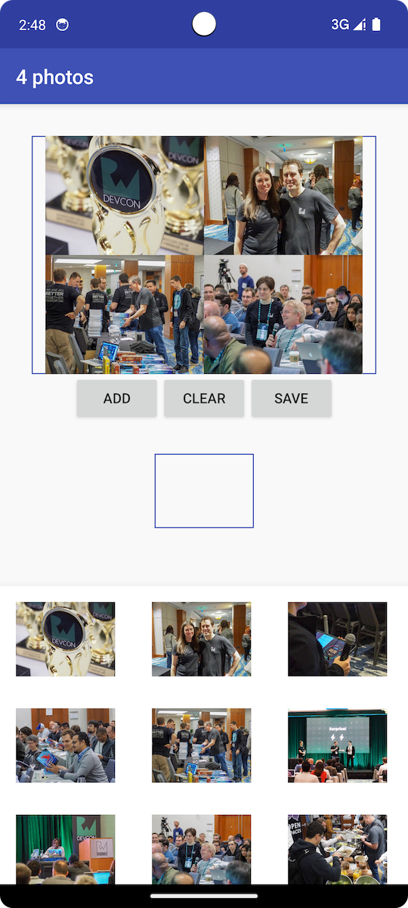

# Observable和Subject的应用

> Subject可以看成是一个桥梁或者代理，在某些ReactiveX实现中（如RxJava），它同时充当了Observer和Observable的角色。因为它是一个Observer，它可以订阅一个或多个Observable；又因为它是一个Observable，它可以转发它收到(Observe)的数据，也可以发射新的数据

如何在实际中运用Observable和Subjec呢？参考`《Reactive Programming with Kotlin》`的相关内容


## 在ViewModel中使用BehaviorSubject

这里为什么要使用`BehaviorSubject`？我自己理解在于其`BehaviorSubject`本身的特性，在订阅后发发送一个默认值，这样页面会更新为一个空页面状态


**监听数据的变化**

总体来说，其数据流向是：

新增or删除图片 -> BehaviorSubject -> MutableLiveData -> LiveData的观察者

`SharedViewModel`

```kotlin
// 处理订阅的销毁相关操作
private val disposables = CompositeDisposable()

// imagesSubject发射MutableList<Photo>类型的值，表示选择的photos，其默认值为空list
private val imagesSubject: BehaviorSubject<MutableList<Photo>> = BehaviorSubject.createDefault(
    mutableListOf()
)

// selectedPhotos
private val selectedPhotos = MutableLiveData<List<Photo>>()

init {
    // 订阅imagesSubject
    imagesSubject.subscribe { photos ->
        // LiveData的更新
        selectedPhotos.value = photos
    }.addTo(disposables)
}

// ViewModels onCleared() method is a great place to dispose of any disposables you may have lying around
override fun onCleared() {
    disposables.clear()
    super.onCleared()
}

fun addPhoto(photo: Photo) {
    // Subject数据变化，并调用onNext
    imagesSubject.value?.add(photo)
    imagesSubject.onNext(imagesSubject.value!!)
}
```


`MainActivity`

```kotlin
        // 监听LiveData
        viewModel.getSelectedPhotos().observe(this, Observer { photos ->
            if (photos.isNotEmpty()) {
                val bitmaps = photos.map {
                    BitmapFactory.decodeResource(resources, it.drawable)
                }
                // 3
                val newBitmap = combineImages(bitmaps)
                // 4
                collageImage.setImageDrawable(
                    BitmapDrawable(resources, newBitmap)
                )
            } else {
                collageImage.setImageResource(android.R.color.transparent)
            }

            // 更新ui
            updateUI(photos)
        })
```


## 使用Subject和其他View通信

例子中，是`MainActivity`和`PhotosBottomDialogFragment`之间的通信

`PhotosBottomDialogFragment`中，内部使用`PublishSubject`，但是暴露出来的是个`Observable<Photo>`类型

```kotlin
    // 内部使用
    private val selectedPhotosSubject = PublishSubject.create<Photo>()

    // 向外暴露的Observable
    val selectedPhotos: Observable<Photo>
        get() = selectedPhotosSubject.hide()
        
    // 选择某个图片后
    override fun photoClicked(photo: Photo) {
        // 发射
        selectedPhotosSubject.onNext(photo)
    }

    // Dialog销毁
    override fun onDestroyView() {
        // 完成
        selectedPhotosSubject.onComplete()
        super.onDestroyView()
    }        
```

`MainActivity`的`ViewModel`会订阅这个Observable

```kotlin
    fun subscribeSelectedPhotos(selectedPhotos: Observable<Photo>) {
        selectedPhotos
            .doOnComplete {
                Log.v("SharedViewModel", "Completed selecting photos")
            }
            .subscribe { photo ->
                imagesSubject.value?.add(photo)
                imagesSubject.onNext(imagesSubject.value!!)
            }
            .addTo(disposables)
    }
```




代码位置：


