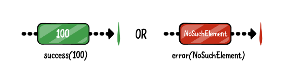
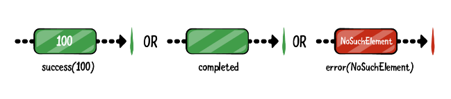
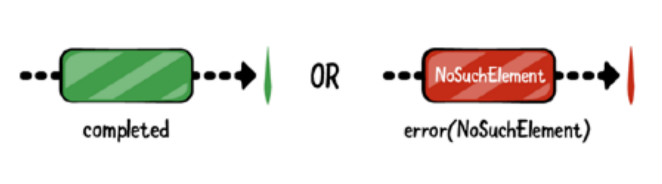

# Single、Maybe、Completable

除`Observable`和`Flowable`外，在RxJava中还有3中类型的被观察者

+ Single
+ Completable
+ Maybe


## Single

Single 只有 `onSuccess` 和 `onError` 事件



这种类型在保存文件、下载文件等情况下很有用，从磁盘加载数据或任何产生一个Value的异步操作

如：

```java
        Single.create(new SingleOnSubscribe<String>() {
            @Override
            public void subscribe(SingleEmitter<String> e) throws Exception {
                e.onSuccess("成功了");
            }
        }).subscribe(new Consumer<String>() {
            @Override
            public void accept(String s) throws Exception {
                System.out.println(s);
            }
        }, new Consumer<Throwable>() {
            @Override
            public void accept(Throwable throwable) throws Exception {
                throwable.printStackTrace();
            }
        });
```

上面用了两个`Consumer`，还可以进一步简化

```java
        Single.create(new SingleOnSubscribe<String>() {
            @Override
            public void subscribe(SingleEmitter<String> e) throws Exception {
                e.onSuccess("成功了");
            }
        }).subscribe(new BiConsumer<String, Throwable>() {
            @Override
            public void accept(String s, Throwable throwable) throws Exception {
                System.out.println(s);
            }
        });
```


**实际使用例子**

在上一节[Observable和Subject的应用](https://github.com/winfredzen/Android-Basic/blob/master/Rx/003_Observable%E5%92%8CSubject%E7%9A%84%E5%BA%94%E7%94%A8.md)的例子中，`saveBitmapFromImageView`返回的是一个`Obserable`，可以将其修改为返回一个`Single`

```kotlin
    fun saveBitmapFromImageView(imageView: ImageView, context: Context): Single<String> {

        return Single.create { emitter ->
            ......

            try {
                ......

                // emit创建图片的名称
                emitter.onSuccess(tmpImg)

            } catch (e: IOException) {
                ......

                // 发生错误，emit错误
                emitter.onError(e)
            }
        }
```

```kotlin
        viewModel.saveBitmapFromImageView(collageImage, this)
            .subscribeOn(Schedulers.io())
            .observeOn(AndroidSchedulers.mainThread())
            .subscribeBy(
            onSuccess = { file ->
                Toast.makeText(this, "$file saved", Toast.LENGTH_SHORT).show()
            },
            onError = { e ->
                Toast.makeText(this, "Error saving file :${e.localizedMessage}", Toast.LENGTH_SHORT)
                    .show()
            }
        )
```


## Maybe

Maybe和Single类似，唯一的不同是，Maybe在成功时may or maynot 发射一个value



Maybe 也只能发射0 或者 1个数据，即使发射多个数据，后面发射的数据也不会处理


## Completable

Completable在创建后，不会发射任何数据




