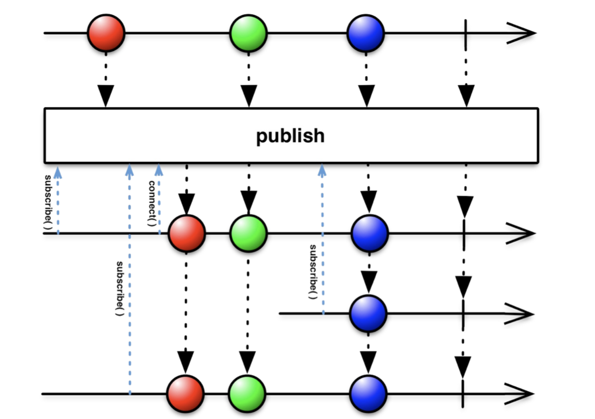

# Cold vs Hot

Hot Observable的特点：

+ Hot Observable无论有没有观察者进行订阅，事件始终都会发生
+ Hot Observable与订阅者们的关系是一对多关系，可以与多个订阅者共享信息


Cold Observable的特点： 

+ Cold Observable是只有观察者订阅了，才开始执行发射数据流的代码
+ Cold Observable和 Observer 是一对一的关系 。当有多个不同的订阅者时，消息是重新完整发迭的。也就是说，对Cold Observable，有多个Observer的时候，它们各自的事件是独立的


**把 Hot Observable 想象成 个广播电台，所有在此刻收听的昕众都会听到同一首歌**

**Cold Observable 一张音乐 CD ，人们可以独立购买并听取它**


## Cold Observable

Observable 的 `just`、`create`、`range`、 `fromXXX` 等操作符都能生成 Cold Observable

如下的例子：

```java
        try {
            // emits a long every 500 milliseconds
            Observable<Long> cold = Observable.interval(500, TimeUnit.MILLISECONDS);
            cold.subscribe(l -> System.out.println("sub1, " + l)); // subscriber1
            Thread.sleep(1000); // interval between the two subscribes
            cold.subscribe(l -> System.out.println("sub2, " + l)); // subscriber2
            Thread.sleep(10000);
        } catch (InterruptedException e) {
            throw new RuntimeException(e);
        }
```

```java
sub1, 0
sub1, 1
sub1, 2
sub2, 0
sub2, 1
sub1, 3
sub2, 2
sub1, 4
sub1, 5
sub2, 3
```

注意，虽然`sub2`晚开始，但它的值是从头开始的


## Hot Observable

将Cold Observable转为Hot Observable

1.使用 `publish` ，生`ConnectableObservable`

2.`ConnectableObservable` 调用 `connect`

如下的例子：

```java
        Observable.interval(500, TimeUnit.MILLISECONDS)
                .publish(); // publish converts cold to hot
        ConnectableObservable<Long> hot = Observable
                .interval(500, TimeUnit.MILLISECONDS)
                .publish(); // returns ConnectableObservable
        hot.connect(); // connect to subscribe

        hot.subscribe(l -> System.out.println("sub1, " + l));
        Thread.sleep(1000);
        hot.subscribe(l -> System.out.println("sub2, " + l));
        Thread.sleep(10000);
```

```java
sub1, 0
sub1, 1
sub1, 2
sub2, 2
sub1, 3
sub2, 3
sub1, 4
sub2, 4
sub1, 5
sub2, 5
```

注意，虽然`sub2`晚开始，但它的值和sub1是同步的


再如下的例子：

```java
        ConnectableObservable<Long> hot = Observable
                .interval(500, TimeUnit.MILLISECONDS)
                .publish(); // same as above
        Disposable subscription = hot.connect(); // connect returns a subscription object, which we store for further use

        hot.subscribe(l -> System.out.println("sub1, " + l));
        Thread.sleep(1000);
        hot.subscribe(l -> System.out.println("sub2, " + l));
        Thread.sleep(1000);
        subscription.dispose(); // disconnect, or unsubscribe from subscription

        System.out.println("reconnecting");
        /* reconnect and redo */
        subscription = hot.connect();
        hot.subscribe(l -> System.out.println("sub1, " + l));
        Thread.sleep(1000);
        hot.subscribe(l -> System.out.println("sub2, " + l));
        Thread.sleep(1000);
        subscription.dispose();
```

```java
sub1, 0
sub1, 1
sub1, 2
sub2, 2
sub1, 3
sub2, 3
reconnecting
sub1, 0
sub1, 1
sub2, 1
sub1, 2
sub2, 2
sub1, 3
sub2, 3
```

断开连接后，Observable “终止”了，并在添加新订阅时重新启动。


### refCount操作符

参考：

+ [RxJava日常使用总结（九）连接操作](https://juejin.cn/post/6844904162635808775#heading-2)

> 有些时候，我们想还是按照Cold Observable去当有Observer订阅就发射数据，但又想拥有Hot Observable的行为特性时，就可以使用RefCount操作符。RefCount相当于Publish操作符的逆向，转换后，这个Observable再被订阅时自动开始发射数据，但是和Cool Observable不同的是，依然还是像Hot Observable一样，如果已经开始发送了，比较后来的Observer再来订阅，**依然不会收到之前的数据**！还有，就是终止的操作则变为所有观察者都取消订阅了，就终止。（Hot Observable需要手动调用Connect返回的disposable去调用dispose()才能终止，相当于开始发送和终止被得自动化了）



RefCount 操作符把一个可连接的 Observable 连接和断开的过程自动化了。它操作一个可连接的Observable 返回一个普通的 Observable 。当第一个订阅者／观察者订阅这个 Observable=时， RefCount 连接到下层的可连接 Observable。 RefCount 跟踪有多少个观察者订阅它，直到最后一个观察者完成，才断开与下层可连接 Observable的连接

如果所有的订阅者／观察者都取消订阅了，则数据流停止：如果重新订阅，则重新开始数据流

```java
        Consumer<Long> subscriber1 = new Consumer<Long>() {
            @Override
            public void accept(Long aLong) {
                System.out.println ("subscriber1 :" + aLong);
            }
        };

        Consumer<Long> subscriber2 = new Consumer<Long>() {
            @Override
            public void accept(Long aLong) {
                System.out.println ("   subscriber2 :" + aLong);
            }
        };

        ConnectableObservable<Long> connectableObservable = Observable.create(new ObservableOnSubscribe<Long>() {
            @Override
            public void subscribe(ObservableEmitter<Long> e) throws Exception {
                Observable.interval(10, TimeUnit.MILLISECONDS, Schedulers.computation())
                        .take(Integer.MAX_VALUE)
                        .subscribe(e::onNext);
            }
        }).observeOn(Schedulers.newThread()).publish();
        connectableObservable.connect();

        // refCount
        Observable<Long> observable = connectableObservable.refCount();

        Disposable disposable1 = observable.subscribe(subscriber1);
        Disposable disposable2 = observable.subscribe(subscriber2);

        Thread.sleep(40);

        disposable1.dispose();
        disposable2.dispose();

        System.out.println ("重新开始数据流");

        disposable1 = observable.subscribe(subscriber1);
        disposable2 = observable.subscribe(subscriber2);

        Thread.sleep(40L);
```

```java
subscriber1 :0
   subscriber2 :0
subscriber1 :1
   subscriber2 :1
subscriber1 :2
   subscriber2 :2
subscriber1 :3
   subscriber2 :3
重新开始数据流
subscriber1 :0
   subscriber2 :0
subscriber1 :1
   subscriber2 :1
subscriber1 :2
   subscriber2 :2
subscriber1 :3
   subscriber2 :3
```

如果不是所有的订阅者／观察者都取消了订阅 ，而只是部分取消，则部分的订阅者／观察者重新开始订阅时，不会从头开始数据流

```java
        Consumer<Long> subscriber1 = new Consumer<Long>() {
            @Override
            public void accept(Long aLong) {
                System.out.println ("subscriber1 :" + aLong);
            }
        };

        Consumer<Long> subscriber2 = new Consumer<Long>() {
            @Override
            public void accept(Long aLong) {
                System.out.println ("   subscriber2 :" + aLong);
            }
        };

        Consumer<Long> subscriber3 = new Consumer<Long>() {
            @Override
            public void accept(Long aLong) {
                System.out.println ("       subscriber3 :" + aLong);
            }
        };

        ConnectableObservable<Long> connectableObservable = Observable.create(new ObservableOnSubscribe<Long>() {
            @Override
            public void subscribe(ObservableEmitter<Long> e) throws Exception {
                Observable.interval(10, TimeUnit.MILLISECONDS, Schedulers.computation())
                        .take(Integer.MAX_VALUE)
                        .subscribe(e::onNext);
            }
        }).observeOn(Schedulers.newThread()).publish();
        connectableObservable.connect();

        // refCount
        Observable<Long> observable = connectableObservable.refCount();

        Disposable disposable1 = observable.subscribe(subscriber1);
        Disposable disposable2 = observable.subscribe(subscriber2);
        observable.subscribe(subscriber3);

        Thread.sleep(40);

        disposable1.dispose();
        disposable2.dispose();

        System.out.println ("重新开始数据流");

        disposable1 = observable.subscribe(subscriber1);
        disposable2 = observable.subscribe(subscriber2);

        Thread.sleep(40L);
```

```java
subscriber1 :0
   subscriber2 :0
       subscriber3 :0
subscriber1 :1
   subscriber2 :1
       subscriber3 :1
subscriber1 :2
   subscriber2 :2
       subscriber3 :2
subscriber1 :3
   subscriber2 :3
       subscriber3 :3
重新开始数据流
       subscriber3 :4
subscriber1 :4
   subscriber2 :4
       subscriber3 :5
subscriber1 :5
   subscriber2 :5
       subscriber3 :6
subscriber1 :6
   subscriber2 :6
       subscriber3 :7
subscriber1 :7
   subscriber2 :7
```


### share操作符

`share` 操作符封装了 `publish().refCount()` 调用


