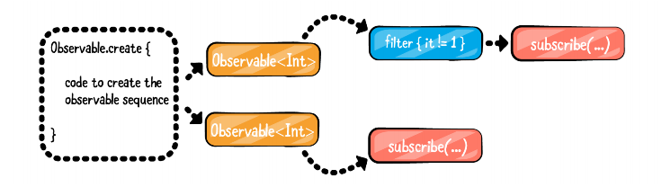
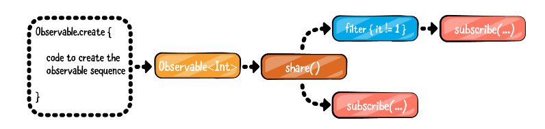

# Share操作符

在项目中有时会遇到这样的写法`fragment.selectedPhotos.share()`

这里的`share()`操作符的含义：

1.如果直接使用`selectedPhotos`这个`Observable`的话，如果有多个observer的话，对每个observer对会创建一个Observable实例

2.如果使用了`share()`，允许多个observer 单个 Observable 

