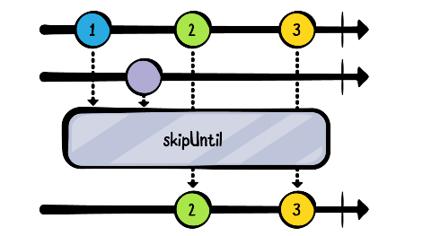
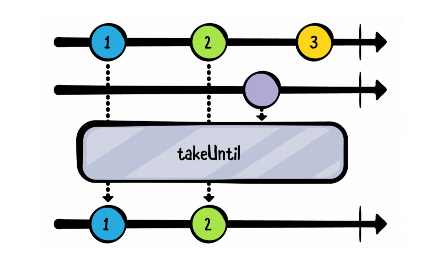
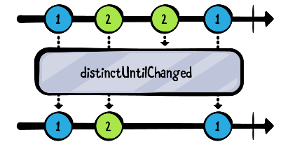

# 过滤操作符

| 过滤操作符             | 说明                                                         |
| ---------------------- | ------------------------------------------------------------ |
| ignoreElements()       | 丢弃所有的正常数据，只发射错误或完成通知                     |
| elementAt()            | 发射第N项数据                                                |
| filter()               | 过滤数据                                                     |
| skip()                 | 跳过开始的N项数据                                            |
| skipWhile()            | 丢弃原始 Observable 发射的数据，直到一个特定的条件为假，然后发射原始 Observable 剩余的数据 |
| skipUntil()            | 丢弃原始 Observable 发射的数据，直到第二个 Observable 发射了一个数据，然后发射原始 Observable 的剩余数据 |
| take()                 | 只发射开始的N项数据                                          |
| takeWhile()            | 先判断是否符合条件，再发送事件。当不符合条件的时候，直接终止 |
| takeUntil()            | 发射来自原始 Observable 的数据，直到第二个 Observable 发射了一个数据或一个通知 |
| distinctUntilChanged() | 过滤掉连续重复的数据                                         |
|                        |                                                              |
|                        |                                                              |
|                        |                                                              |
|                        |                                                              |


## skipWhile

skipWhile 允许使用predicate来确定应跳过的内容。 然而，与filter不同的是，filter会在订阅的生命周期中过滤元素，skipWhile 只会跳过某些内容，直到不跳过某些内容，然后从该点开始让其他所有内容通过

```kotlin
    exampleOf("skipWhile") {
        val subscriptions = CompositeDisposable()
        subscriptions.add(
            Observable.just(2, 2, 3, 4)
                .skipWhile { number ->
                    number % 2 == 0
                }.subscribe {
                    println(it)
                })
    }
```

输出结果为：

```kotlin
3
4
```


## skipUntil



如上图所示，skipUntil会忽略source observable（第一行）发出的数据，直至 trigger observable（第二行）发出一个事件

```kotlin
    exampleOf("skipUntil") {
        val subscriptions = CompositeDisposable()
        val subject = PublishSubject.create<String>()
        val trigger = PublishSubject.create<String>()
        subscriptions.add(
            subject.skipUntil(trigger)
                .subscribe {
                    println(it)
                })

        subject.onNext("A")
        subject.onNext("B")

        trigger.onNext("X")
        subject.onNext("C")
    }
```

输出结果为：

```kotlin
C
```


## takeWhile

先判断是否符合条件，再发送事件。当不符合条件的时候，直接终止

```kotlin
    exampleOf("takeWhile") {
        val subscriptions = CompositeDisposable()
        subscriptions.add(
            Observable.fromIterable(
                listOf(1, 2, 7, 3, 4, 5, 6, 7, 8, 9, 10, 1))
                .takeWhile { number ->
                    number < 5
                }.subscribe {
                    println(it)
                })
    }
```

```kotlin
1
2
```


## takeUntil



发射来自原始 Observable 的数据，直到第二个 Observable 发射了一个数据或一个通知

```kotlin
    val subscriptions = CompositeDisposable()
    val subject = PublishSubject.create<String>()
    val trigger = PublishSubject.create<String>()
    subscriptions.add(
        subject.takeUntil(trigger)
            .subscribe {
                println(it)
            })
    subject.onNext("1")
    subject.onNext("2")
    trigger.onNext("X")
    subject.onNext("3")
```

```kotlin
1
2
```


## distinctUntilChanged

过滤掉连续重复的数据



```kotlin
exampleOf("distinctUntilChanged") {
 val subscriptions = CompositeDisposable()
 subscriptions.add(
 // 1
 Observable.just("Dog", "Cat", "Cat", "Dog")
 // 2
 .distinctUntilChanged()
 .subscribe {
 println(it)
 })
}
```

```kotlin
Dog
Cat
Dog
```

另一个有判断的例子：

```kotlin
    exampleOf("distinctUntilChangedPredicate") {
        val subscriptions = CompositeDisposable()
        subscriptions.add(
            Observable.just(
                "ABC", "BCD", "CDE", "FGH", "IJK", "JKL", "LMN")
                .distinctUntilChanged { first, second ->
                    // Return true if any character in the second string is also in the first string.
                    second.any { it in first }
                }
                .subscribe {
                    println(it)
                }
        )
    }
```

```kotlin
ABC
FGH
IJK
```


