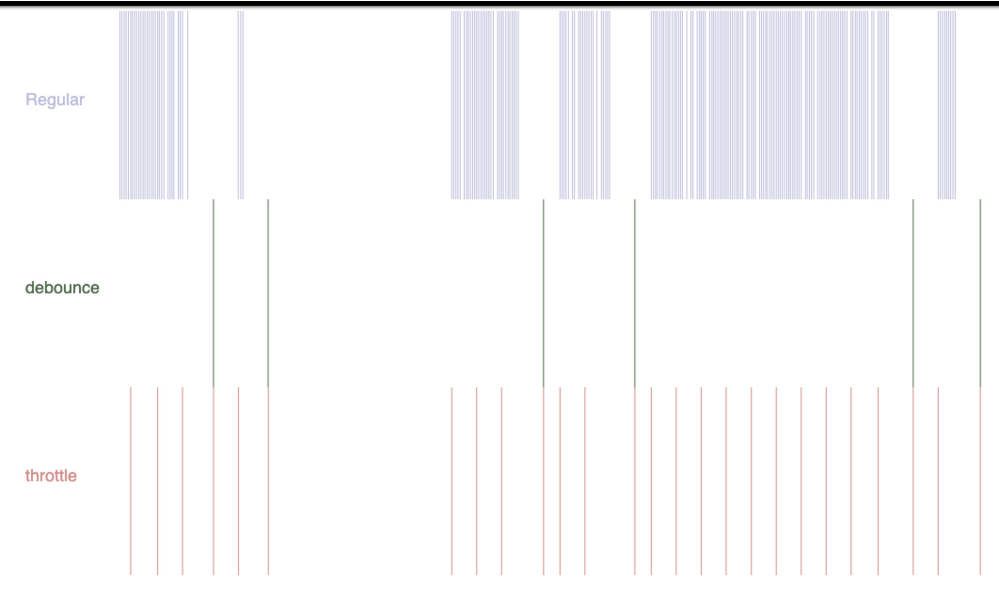

# 防抖 vs 节流

可参考如下的内容：

+ [debounce_throttle](https://web.archive.org/web/20220117092326/http://demo.nimius.net/debounce_throttle/)

是怎样实现的？

Debounce - 防抖，就是在函數域加入一個計時器，如果事件一直觸發，便刷新計時器，直至計時器時限內沒有觸發該事件，便執行事件行為

Throttle - 节流，在函數域加入一個計時器並記錄最新一次執行的時間點，並把現在的時間點與記錄的時間點再比較，如果差距超過設定時限，便允許再次執行事件任務，並記下新的執行時間點。

