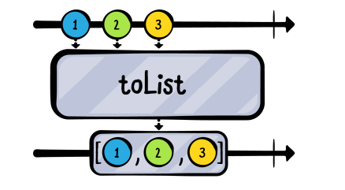
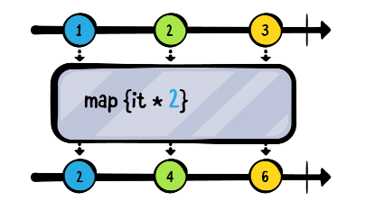
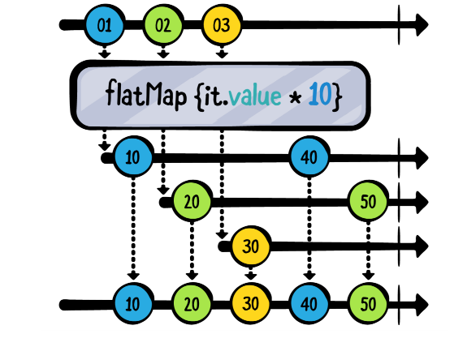
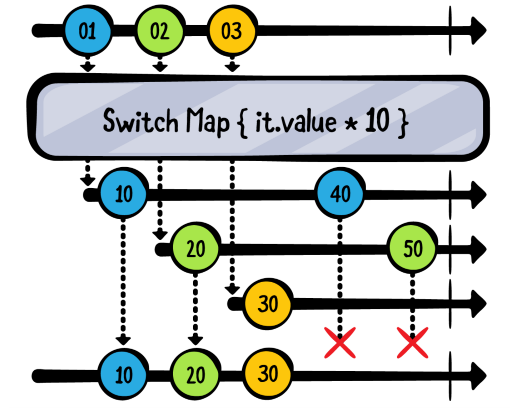
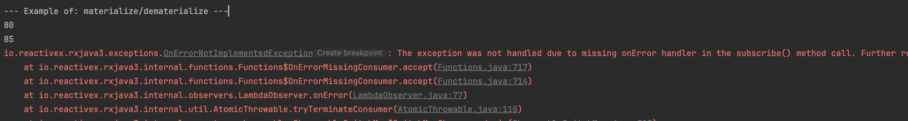
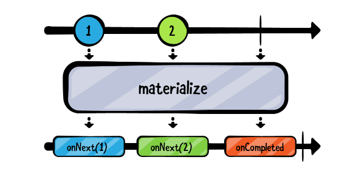
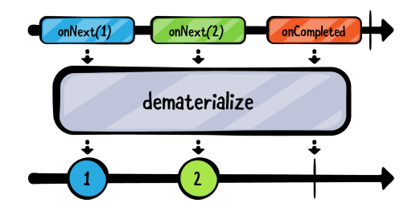

# 变换操作符


## toList

将单个元素变换为List



```kotlin
    exampleOf("toList") {
        val subscriptions = CompositeDisposable()
        val items = Observable.just("A", "B", "C")
        subscriptions.add(
            items
                .toList()
                .subscribeBy {
                    println(it)
                }
        )
    }
```


## map

对序列的每一项都用一个函数来变换 `Observable` 发射的数据序列



```kotlin
    exampleOf("map") {
        val subscriptions = CompositeDisposable()
        subscriptions.add(
            Observable.just("M", "C", "V", "I")
                .map {
                    it.romanNumeralIntValue()
                }
                .subscribeBy {
                    println(it)
                })
    }
```


## flatMap

参考：

+ [FlatMap](https://mcxiaoke.gitbooks.io/rxdocs/content/operators/FlatMap.html)

> `flatMap`将一个发射数据的Observable变换为多个Observables，然后将它们发射的数据合并后放进一个单独的`Observable`
>
> `FlatMap`操作符使用一个指定的函数对原始Observable发射的每一项数据执行变换操作，这个函数返回一个本身也发射数据的Observable，然后`FlatMap`合并这些Observables发射的数据，最后将合并后的结果当做它自己的数据序列发射。
>
> 这个方法是很有用的，例如，当你有一个这样的Observable：它发射一个数据序列，这些数据本身包含Observable成员或者可以变换为Observable，因此你可以创建一个新的Observable发射这些次级Observable发射的数据的完整集合。
>
> 注意：`FlatMap`对这些Observables发射的数据做的是合并(`merge`)操作，因此它们可能是交错的。

例子一：



```kotlin
    class Student(val score: BehaviorSubject<Int>)
    
    exampleOf("map") {
        val subscriptions = CompositeDisposable()
        val ryan = Student(BehaviorSubject.createDefault(80))
        val charlotte = Student(BehaviorSubject.createDefault(90))
        val student = PublishSubject.create<Student>()

        student
            .flatMap { it.score }
            .subscribe { println(it) }
            .addTo(subscriptions)

        student.onNext(ryan)
        ryan.score.onNext(85)

        student.onNext(charlotte)
        ryan.score.onNext(95)
    }
```

```kotlin
80
85
90
95
```


例子二：

如果想打印出某个用户所有的地 那么可 `map` 操作符返回一个地址的列表

```java
public class User {

    public String userName;
    public List<Address> addresses;

    public static class Address {
        public String street;
        public String city;
    }


    public static void main(String[] args) {

        User user = new User();
        user.userName = "tony";
        user.addresses = new ArrayList<>();
        User.Address address1 = new User.Address();
        address1.street = "人民路";
        address1.city = "苏州";
        user.addresses.add(address1);
        User.Address address2 = new User.Address();
        address2.street = "中山路";
        address2.city = "深圳";
        user.addresses.add(address2);

        Observable.just(user)
                .map(new Function<User, List<Address>>() {
                    @Override
                    public List<Address> apply(User user) throws Exception {
                        return user.addresses;
                    }
                }).subscribe(new Consumer<List<Address>>() {
                    @Override
                    public void accept(List<Address> addresses) throws Exception {
                        for (User.Address address:addresses) {
                            System.out.println(address.street);
                        }
                    }
                });
    }

}
```

换成 `flatMap` 操作符之后， `flatMap` 内部将用户的地址列表转换成一个 `Observable`

```java
        Observable.just(user)
                .flatMap(new Function<User, ObservableSource<User.Address>>() {
                    @Override
                    public Observable<User.Address> apply(User user) throws Exception {
                        return Observable.fromIterable(user.addresses);
                    }
                }).subscribe(new Consumer<User.Address>() {
                    @Override
                    public void accept(User.Address address) throws Exception {
                        System.out.println(address.street);
                    }
                });
```


## switchMap

RxJava还实现了`switchMap`操作符。它和`flatMap`很像，除了一点：当原始Observable发射一个新的数据（Observable）时，它将取消订阅并停止监视产生执之前那个数据的Observable，只监视当前这一个



```kotlin
    exampleOf("switchMap") {
        val ryan = Student(BehaviorSubject.createDefault(80))
        val charlotte = Student(BehaviorSubject.createDefault(90))
        val student = PublishSubject.create<Student>()
        student
            .switchMap { it.score }
            .subscribe { println(it) }
        student.onNext(ryan)
        ryan.score.onNext(85)
        student.onNext(charlotte)
        ryan.score.onNext(95)
        charlotte.score.onNext(100)
    }
```

```kotlin
80
85
90
100
```

可见`ryan.score.onNext(95)`并没有在控制台输出，原因是`charlotte`已经emit，`switchMap`此后只会emit `charlotte`的value。而且由于charlotte是`BehaviorSubject`类型，它会直接emit它的最新值

> 所以你可能想知道什么时候会使用 flatMap 或 switchMap？ 大概是使用 switchMap 最常见的用例是网络操作。举一个简单的示例，想象一下您正在实施type-ahead搜索。 当用户键入每个字母时，例如 k、o、t、l、
> i,n，您需要执行新的搜索并忽略前一个搜索的结果。switchMap 就是你这样做的方法。


## materialize

materialize将一个普通的 Observable ，转换为一个emit **Notification** Observable对象，该对象包装了`onNext`、`onComplete` or `onError`

```kotlin
    exampleOf("materialize/dematerialize") {
        val subscriptions = CompositeDisposable()
        val ryan = Student(BehaviorSubject.createDefault(80))
        val charlotte = Student(BehaviorSubject.createDefault(90))
        val student = BehaviorSubject.createDefault(ryan)

        val studentScore = student
            .switchMap { it.score }
        subscriptions.add(studentScore
            .subscribe {
                println(it)
            })
        ryan.score.onNext(85)
        ryan.score.onError(RuntimeException("Error!"))
        ryan.score.onNext(90)
        student.onNext(charlotte)
    }
```



error未被处理，导致studentScore被终止了


使用materialize操作符，将 Observable emit的每个事件包裹在`Notification`中



```kotlin
    exampleOf("materialize/dematerialize") {
        val subscriptions = CompositeDisposable()
        val ryan = Student(BehaviorSubject.createDefault(80))
        val charlotte = Student(BehaviorSubject.createDefault(90))
        val student = BehaviorSubject.createDefault(ryan)

        val studentScore = student
            .switchMap { it.score.materialize() }
        subscriptions.add(studentScore
            .subscribe {
                println(it)
            })
        ryan.score.onNext(85)
        ryan.score.onError(RuntimeException("Error!"))
        ryan.score.onNext(200)
        student.onNext(charlotte)
    }
```

此时输出结果为：

```kotlin
OnNextNotification[80]
OnNextNotification[85]
OnErrorNotification[java.lang.RuntimeException: Error!]
OnNextNotification[90]
```


## **dematerialize** 

`dematerialize`操作符，将materialized Observable转为原来的形式




```kotlin
    exampleOf("materialize/dematerialize") {
        val subscriptions = CompositeDisposable()
        val ryan = Student(BehaviorSubject.createDefault(80))
        val charlotte = Student(BehaviorSubject.createDefault(90))
        val student = BehaviorSubject.createDefault(ryan)

        val studentScore = student
            .switchMap { it.score.materialize() }
        subscriptions.add(studentScore
            .subscribe {
//                println(it)
            })

        studentScore
            .filter {
                if (it.error != null) {
                    println(it.error)
                    false
                } else {
                    true
                }
            }
            .dematerialize { it }
            .subscribe {
                println(it)
            }
            .addTo(subscriptions)

        ryan.score.onNext(85)
        ryan.score.onError(RuntimeException("Error!"))
        ryan.score.onNext(200)
        student.onNext(charlotte)

    }
```

```kotlin
80
85
java.lang.RuntimeException: Error!
90
```


