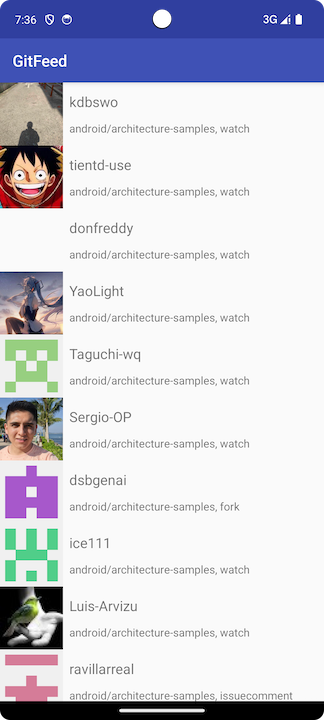

# 变换操作符的应用

内容来自 `《Reactive Programming with Kotlin》`

例子以请求Github数据来做说明

```kotlin
  @GET("repos/ReactiveX/{repo}/events")
  fun fetchEvents(@Path("repo") repo: String, @Header("If-Modified-Since") lastModified: String)
      : Observable<Response<List<AnyDict>>>
```

请求示例如下：

```kotlin
    fun fetchEvents(repo: String) {
        eventLiveData.value = EventsStore.readEvents()

        val lastModified = EventsStore.readLastModified()

        // share 共享
        val apiResponse = gitHubApi.fetchEvents(repo, lastModified?.trim() ?: "").share()

        apiResponse
            .filter { response ->
                // 过滤请求成功的数据
                (200..300).contains(response.code())
            }
            .map { response ->
                // 将Response变换为 List<AnyDict>?
                response.body()!!
            }
            .filter { objects ->
                // 过滤空List
                objects.isNotEmpty()
            }
            .map { objects ->
                // 将AnyDict转为Event
                objects.mapNotNull { Event.fromAnyDict(it) }
            }
            .subscribeOn(Schedulers.io())
            .observeOn(AndroidSchedulers.mainThread())
            .subscribeBy(
                onNext = { events -> processEvents(events) },
                onError = { error -> println("Events Error ::: ${error.message}") },
                onComplete = { println("onComplete") }
            )
            .addTo(disposables)

        apiResponse
            .filter { response ->
                // 过滤请求成功的数据
                (200 until 300).contains(response.code())
            }
            .flatMap { response ->
                // value可能为null
                val value = response.headers().get("Last-Modified")
                if (value == null) {
                    Observable.empty()
                } else {
                    Observable.just(value)
                }
            }
            .subscribeOn(Schedulers.io())
            .observeOn(AndroidSchedulers.mainThread())
            .subscribeBy(
                onNext = { EventsStore.saveLastModified(it) },
                onError = { error -> println("Last Modified Error ::: ${error.message}") }
            )
            .addTo(disposables)
    }
```





[源码](https://github.com/winfredzen/Android-Basic/tree/master/Rx/source_code/GitFeed-Final)

