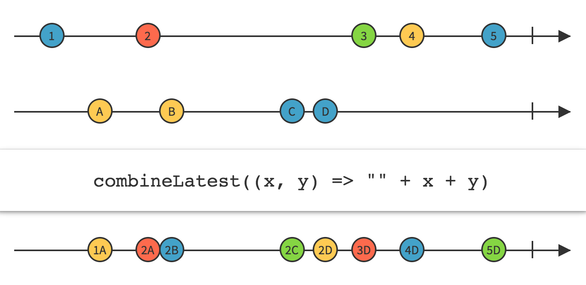

# 合并和连接操作符


## merge

参考：

+ [Merge](https://mcxiaoke.gitbooks.io/rxdocs/content/operators/Merge.html)


合并多个 Observable 的发射物

如果传递给 merge 的任何一个`Observable`发射了`onError` 终止，则 `merge` 操作符生成的 `Observable` 也会立即以 `onError` 通知终止

如果想让它继续发射数据，直到最后才报告错误，则可以使用 `mergeDelayError` 操作符


```kotlin
    exampleOf("Merge") {
        val subscriptions = CompositeDisposable()

        val left = PublishSubject.create<Int>()
        val right = PublishSubject.create<Int>()

        Observable.merge(left, right).subscribe {
            println(it)
        }.addTo(subscriptions)

        left.onNext(0)
        left.onNext(1)
        right.onNext(3)
        left.onNext(4)
        right.onNext(5)
        right.onNext(6)
    }
```

```kotlin
0
1
3
4
5
6
```


## mergeWith

如果只是两个被观察者合井，则还可以使用 `mergeWith` 操作符

```kotlin
    exampleOf("Merge") {
        val subscriptions = CompositeDisposable()

        val germanCities = PublishSubject.create<String>()
        val spanishCities = PublishSubject.create<String>()

        germanCities.mergeWith(spanishCities).subscribe {
            println(it)
        }.addTo(subscriptions)

        germanCities.onNext("Frankfurt")
        germanCities.onNext("Berlin")
        spanishCities.onNext("Madrid")
        germanCities.onNext("Münich")
        spanishCities.onNext("Barcelona")
        spanishCities.onNext("Valencia")
    }
```

```kotlin
Frankfurt
Berlin
Madrid
Münich
Barcelona
Valencia
```


## zip

参考：

+ [Zip](https://mcxiaoke.gitbooks.io/rxdocs/content/operators/Zip.html)

通过一个函数将多个 Observable 的发射物结合到一起，基于这个函数的结果为每个结合体发射单个数据项

zip 只发射与发射数据项最少的那个 Observable 一样多的数据


```java
        Observable<Integer> odds = Observable.just(1, 3, 5);
        Observable<Integer> evens = Observable.just(2, 4, 6);
        Observable.zip(odds, evens, new BiFunction<Integer, Integer, Integer>() {
            @Override
            public Integer apply(Integer integer1, Integer integer2) throws Exception {
                return integer1 + integer2;
            }
        }).subscribe(new Consumer<Integer>() {
            @Override
            public void accept(Integer integer) throws Exception {
                System.out.println("Next :" + integer);
            }
        }, new Consumer<Throwable>() {
            @Override
            public void accept(Throwable throwable) throws Exception {
                System.err.println("Error: " + throwable.getMessage());
            }
        }, new Action() {
            @Override
            public void run() throws Exception {
                System.out.println("Sequence complete.");
            }
        });
```

```java
Next :3
Next :7
Next :11
Sequence complete.
```


另一个kotlin的例子：

```kotlin
    exampleOf("Zip") {
        val subscriptions = CompositeDisposable()

        val left = PublishSubject.create<String>()
        val right = PublishSubject.create<String>()

        // rxkotlin中的方法
        Observables.zip(left, right) { weather, city ->
            "It’s $weather in $city"
        }.subscribe(Consumer {
            println(it)
        }, Consumer {
            println(it.message)
        }).addTo(subscriptions)

        left.onNext("sunny")
        right.onNext("Lisbon")
        left.onNext("cloudy")
        left.onError(Throwable("Error"))
        right.onNext("Copenhagen")
        left.onNext("cloudy")
        right.onNext("London")
        left.onNext("sunny")
        right.onNext("Madrid")
        right.onNext("Vienna")
    }
```

```kotlin
It’s sunny in Lisbon
Error
```


## combineLatest

参考：

+ [CombineLatest](https://mcxiaoke.gitbooks.io/rxdocs/content/operators/CombineLatest.html)


当两个Observables中的任何一个发射了数据时，使用一个函数结合每个Observable发射的最近数据项，并且基于这个函数的结果发射数据




