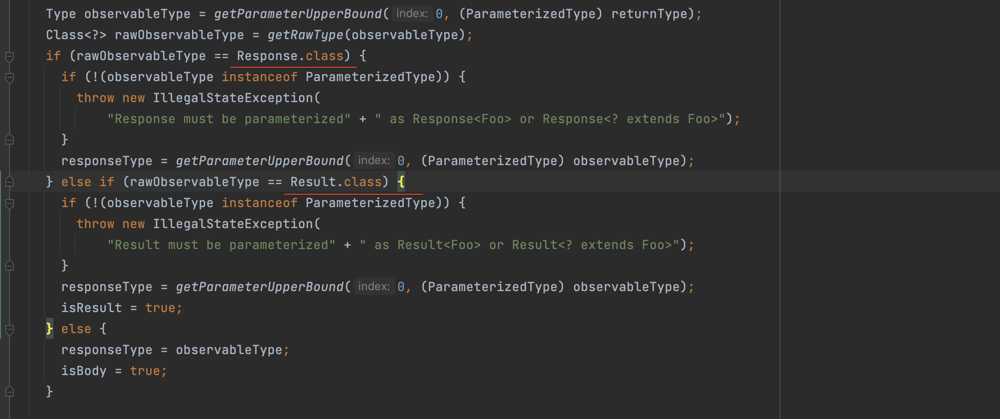

# RxJava & Retrofit

参考：

+ [Android：Retrofit 与 RxJava联合使用大合集（含实例教程）！](https://blog.csdn.net/carson_ho/article/details/79125101)
+ [RxJava2开发小记：用CompositeDisposable来“安排”Retrofit网络请求](https://blog.csdn.net/ysy950803/article/details/84930656)


## 设置Retrofit支持RxJava

一般在创建`Retrofit`时，通过`Retrofit.Builder`的`addCallAdapterFactory`方法来设置

该方法的说明是：

> ```java
> Add a call adapter factory for supporting service method return types other than {@link* Call}.
> ```

> 即支持返回其它类型，而不是`Call`


> `addConverterFactory`和`addCallAdapterFactory`区别
>
> 参考：
>
> + [Retrofit源码解析---addConverterFactory和addCallAdapterFactory区别](https://blog.csdn.net/new_abc/article/details/53021387)
>
> `addConverterFactory()` 其实就是为了处理请求数据和响应数据的


## 调用过程

比如一个请求接口`GitHubService`，

```java
public interface GitHubService {
  @GET("users/{user}/repos")
  Call<List<Repo>> listRepos(@Path("user") String user);
}
```

通过`GitHubService service = retrofit.create(GitHubService.class);`获取到`GitHubService`

看看`public <T> T create(final Class<T> service)` 方法


`loadServiceMethod(Method method)`方法返回的是`ServiceMethod`，是一个抽象类


最终调用的是`HttpServiceMethod`的`parseAnnotations`方法


可以理解为上面`create`方法，最终调用的是`CallAdapted`的`invoke`方法

而`CallAdapted`又是继承自`HttpServiceMethod`的，所以最终调用的是`callAdapter`的`adapt`方法


`callAdapter`是通过`createCallAdapter`创建的，最终会调用到`Retrofit.java`中的


这里就是`RxJava2CallAdapter`，调用其`adapt`方法


可参考的其它资料：

+ [从架构角度看Retrofit的作用、原理和启示](https://www.jianshu.com/p/f57b7cdb1c99)


## 返回值的类型

RxJava和Retrofit结合后，网络请求有3种返回形式：`Observable<BodyType>`, `Observable<Response<BodyType>>`, 或者 `Observable<Result<BodyType>>`

从`RxJava3CallAdapterFactory`的源码也可以看出来：




